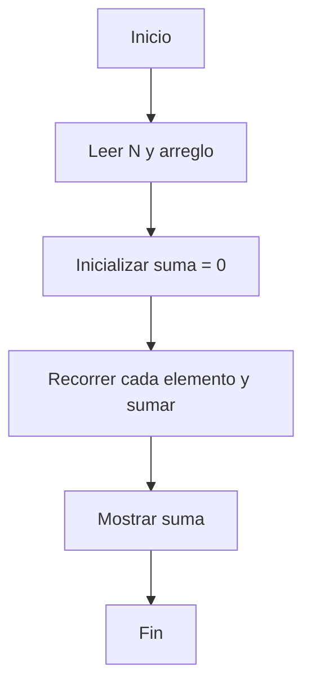

# Ejercicio 2: Suma de Elementos  
**Descripción:**  
- **COMO:** Analista de datos  
- **QUIERO:** Calcular la suma de todos los elementos de un arreglo  
- **PARA:** Practicar recorridos secuenciales y acumuladores  

**Entrada:**  
```
4  
10 20 30 40
```

**Salida:**  
```
100
```




```

```java
public class SumaElementos {
    public static int sumar(int[] arr) {
        int s = 0;
        for (int v : arr) s += v;
        return s;
    }
    public static void main(String[] args) {
        int[] arr = {10,20,30,40};
        System.out.println(sumar(arr));
    }
}
```