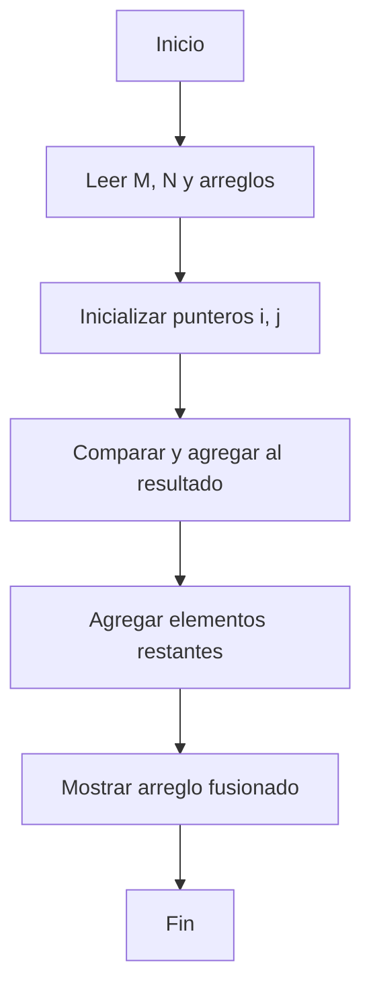

## Ejercicio 4: Merge de Arreglos Ordenados

```markdown
# Ejercicio 4: Merge de Arreglos Ordenados  
**Descripción:**  
- **COMO:** Desarrollador  
- **QUIERO:** Combinar dos arreglos ordenados en uno solo ordenado  
- **PARA:** Practicar fusiones secuenciales  

**Entrada:**  
```
3 4  
1 4 6  
2 3 5 7
```

**Salida:**  
```
1 2 3 4 5 6 7
```




```

```java
import java.util.*;
public class MergeSorted {
    public static int[] merge(int[] a, int[] b) {
        int i=0, j=0, k=0;
        int[] res = new int[a.length + b.length];
        while(i < a.length && j < b.length) {
            res[k++] = (a[i] <= b[j]) ? a[i++] : b[j++];
        }
        while(i < a.length) res[k++] = a[i++];
        while(j < b.length) res[k++] = b[j++];
        return res;
    }
    public static void main(String[] args) {
        int[] a = {1,4,6}, b = {2,3,5,7};
        System.out.println(Arrays.toString(merge(a,b)));
    }
}
```