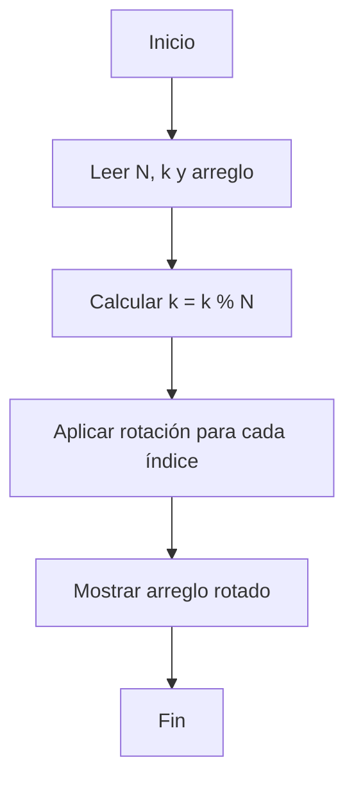

# Ejercicio 5: Rotación de Arreglo  
**Descripción:**  
- **COMO:** Ingeniero de software  
- **QUIERO:** Rotar los elementos de un arreglo k posiciones a la derecha  
- **PARA:** Entender desplazamientos secuenciales  

**Entrada:**  
```
5 2  
10 20 30 40 50
```

**Salida:**  
```
40 50 10 20 30
```




```

```java
public class RotarArreglo {
    public static int[] rotar(int[] arr, int k) {
        int n = arr.length;
        k %= n;
        int[] res = new int[n];
        for (int i = 0; i < n; i++) {
            res[(i + k) % n] = arr[i];
        }
        return res;
    }
    public static void main(String[] args) {
        int[] arr = {10,20,30,40,50};
        for (int v : rotar(arr, 2)) System.out.print(v + " ");
    }
}