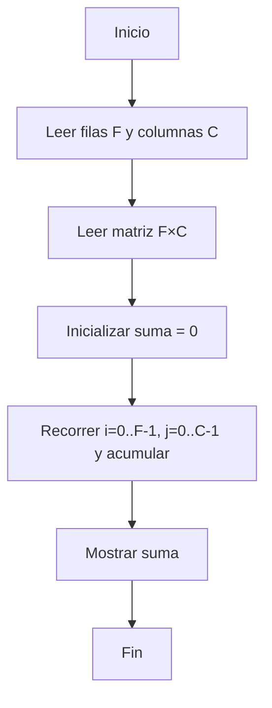

# Ejercicio 2.1: Suma de Elementos de una Matriz  
**Descripción:**  
- **COMO:** Analista de datos  
- **QUIERO:** Calcular la suma de todos los elementos en una matriz  
- **PARA:** Practicar recorridos bidimensionales  

**Entrada:**  
```
2 3  
1 2 3  
4 5 6
```

**Salida:**  
```
21
```




```

```java
public class SumaMatriz {
    public static int sumar(int[][] m) {
        int s = 0;
        for (int[] fila : m) {
            for (int v : fila) s += v;
        }
        return s;
    }
    public static void main(String[] args) {
        int[][] m = {{1,2,3},{4,5,6}};
        System.out.println(sumar(m));
    }
}
```