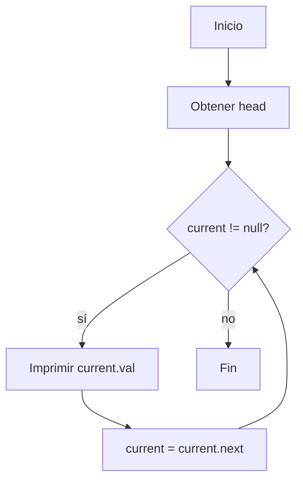

# Ejercicio 3.1: Recorrido de Lista Enlazada  
**Descripción:**  
- **COMO:** Programador  
- **QUIERO:** Recorrer todos los nodos de una lista enlazada  
- **PARA:** Practicar accesos secuenciales  

**Entrada:**  
```
5  
1 -> 2 -> 3 -> 4 -> 5 -> null
```

**Salida:**  
```
1 2 3 4 5
```




```
```java
class Node { int val; Node next; Node(int v){val=v;} }
public class RecorrerLista {
    public static void traverse(Node head) {
        Node cur = head;
        while (cur != null) {
            System.out.print(cur.val + " ");
            cur = cur.next;
        }
    }
    public static void main(String[] args) {
        Node head = new Node(1);
        Node cur = head;
        for (int i = 2; i <= 5; i++) {
            cur.next = new Node(i);
            cur = cur.next;
        }
        traverse(head);
    }
}
```