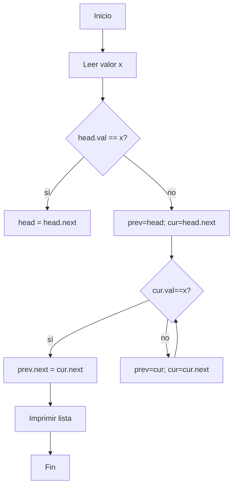

# Ejercicio 3.3: Eliminar Nodo con Valor Dado  
**Descripción:**  
- **COMO:** Ingeniero  
- **QUIERO:** Eliminar el primer nodo que tenga un valor especificado  
- **PARA:** Practicar operaciones de borrado  

**Entrada:**  
```
Lista: 1->2->3->4->null  
Eliminar: 3
```

**Salida:**  
```
1 -> 2 -> 4 -> null
```




```
```java
class Node3 { int val; Node3 next; Node3(int v){val=v;} }
public class EliminarNodo {
    public static Node3 delete(Node3 head, int x) {
        if (head.val == x) return head.next;
        Node3 prev = head, cur = head.next;
        while (cur != null && cur.val != x) {
            prev = cur; cur = cur.next;
        }
        if (cur != null) prev.next = cur.next;
        return head;
    }
    public static void main(String[] args) {
        Node3 head = new Node3(1);
        head.next=new Node3(2); head.next.next=new Node3(3); head.next.next.next=new Node3(4);
        head = delete(head, 3);
        Node3 cur = head; while(cur!=null){System.out.print(cur.val+" ");cur=cur.next;}
    }
}
```