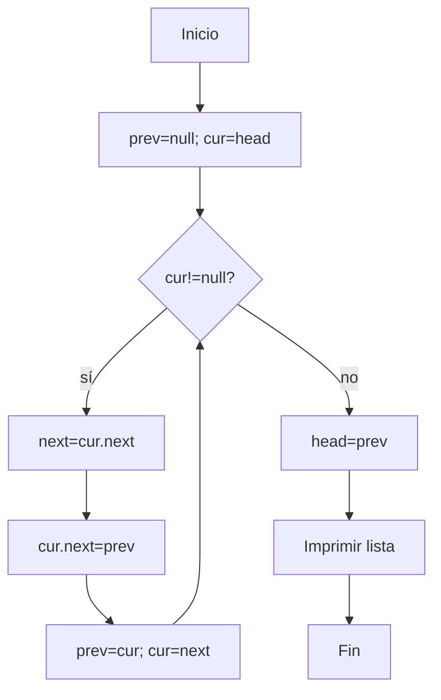

# Ejercicio 3.4: Revertir una Lista Enlazada  
**Descripción:**  
- **COMO:** Desarrollador  
- **QUIERO:** Invertir los enlaces de la lista  
- **PARA:** Aprender a manipular punteros  

**Entrada:**  
```
1->2->3->null
```

**Salida:**  
```
3->2->1->null
```




```
```java
class Node4 { int val; Node4 next; Node4(int v){val=v;} }
public class RevertirLista {
    public static Node4 reverse(Node4 head) {
        Node4 prev = null, cur = head;
        while (cur != null) {
            Node4 nxt = cur.next;
            cur.next = prev;
            prev = cur;
            cur = nxt;
        }
        return prev;
    }
    public static void main(String[] args) {
        Node4 head = new Node4(1);
        head.next = new Node4(2); head.next.next = new Node4(3);
        head = reverse(head);
        Node4 cur = head; while(cur!=null){System.out.print(cur.val+" ");cur=cur.next;}
    }
}
```