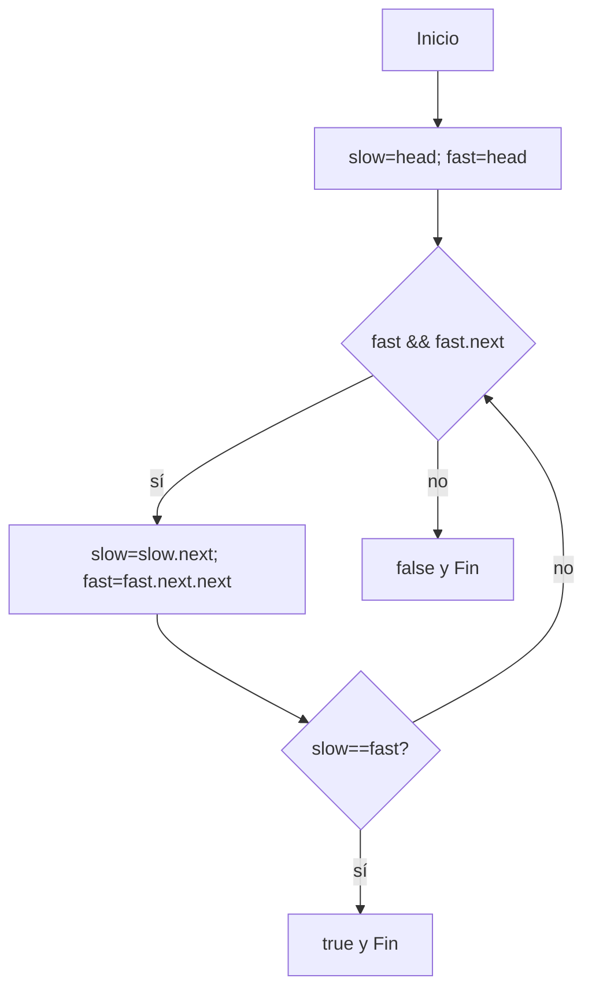

## Ejercicio 3.5: Detectar Ciclo en Lista  
```markdown
# Ejercicio 3.5: Detectar Ciclo en Lista Enlazada  
**Descripción:**  
- **COMO:** Ingeniero de software  
- **QUIERO:** Saber si existe un ciclo  
- **PARA:** Practicar algoritmo de tortuga y liebre  

**Entrada:**  
```
Lista: 1->2->3->4->2 (ciclo en 2)
```

**Salida:**  
```
true
```




```
```java
class Node5 { int val; Node5 next; Node5(int v){val=v;} }
public class DetectarCiclo {
    public static boolean hasCycle(Node5 head) {
        Node5 slow = head, fast = head;
        while (fast != null && fast.next != null) {
            slow = slow.next;
            fast = fast.next.next;
            if (slow == fast) return true;
        }
        return false;
    }
    public static void main(String[] args) {
        Node5 head = new Node5(1);
        head.next = new Node5(2); head.next.next = new Node5(3);
        head.next.next.next = new Node5(4);
        head.next.next.next.next = head.next; // ciclo
        System.out.println(hasCycle(head));
    }
}
```