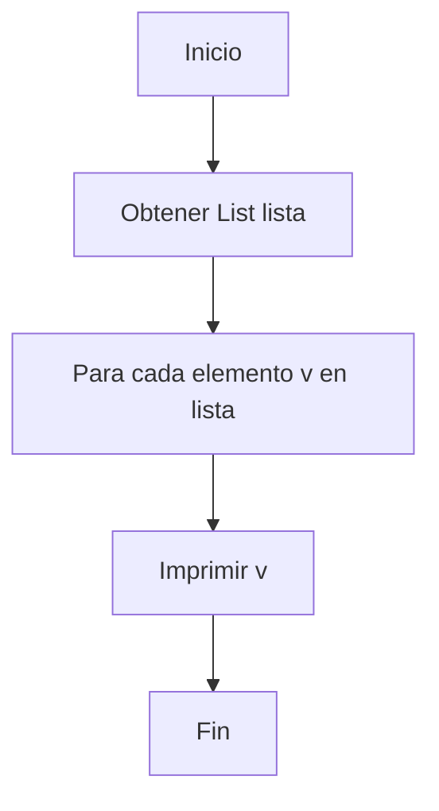

# Ejercicio 4.1: Recorrer Lista de Enteros  
**Descripción:**  
- **COMO:** Programador  
- **QUIERO:** Recorrer una `List<Integer>`  
- **PARA:** Practicar iteración usando la interfaz `List`  

**Entrada:**  
```
[10, 20, 30, 40, 50]
```

**Salida:**  
```
10 20 30 40 50
```




```

```java
import java.util.*;
public class RecorrerList {
    public static void main(String[] args) {
        List<Integer> lista = Arrays.asList(10,20,30,40,50);
        for (int v : lista) {
            System.out.print(v + " ");
        }
    }
}
```