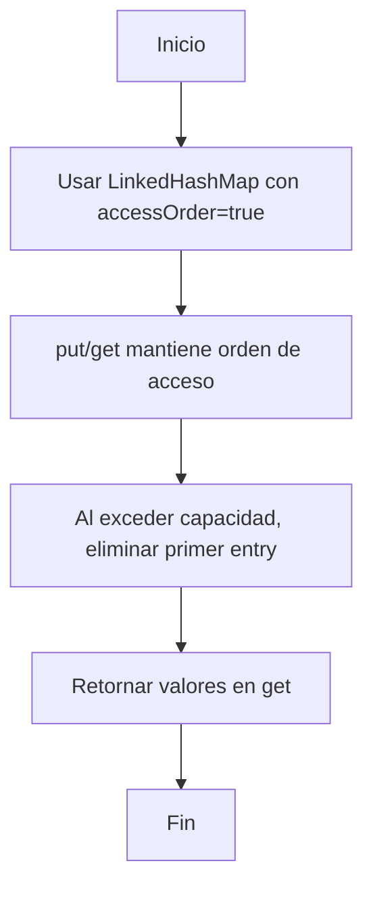

# Ejercicio 6.4: LRU Cache  
**Descripción:**  
- **COMO:** Ingeniero de software  
- **QUIERO:** Implementar caché LRU con capacidad N  
- **PARA:** Practicar uso de `LinkedHashMap` o `Deque`  

**Entrada:**  
```
Capacidad=2  
Operaciones: put(1,1), put(2,2), get(1), put(3,3), get(2), put(4,4), get(1), get(3), get(4)
```

**Salida:**  
```
1  -1  -1  3  4
```
```




```

```java
import java.util.*;
public class LRUCache {
    private final int cap;
    private LinkedHashMap<Integer,Integer> map;
    public LRUCache(int capacity) {
        cap = capacity;
        map = new LinkedHashMap<>(capacity, 0.75f, true) {
            protected boolean removeEldestEntry(Map.Entry<Integer,Integer> e) {
                return size() > cap;
            }
        };
    }
    public int get(int key) { return map.getOrDefault(key, -1); }
    public void put(int key, int val) { map.put(key, val); }
    public static void main(String[] args) {
        LRUCache c = new LRUCache(2);
        c.put(1,1); c.put(2,2);
        System.out.println(c.get(1));
        c.put(3,3);
        System.out.println(c.get(2));
        c.put(4,4);
        System.out.println(c.get(1)); System.out.println(c.get(3)); System.out.println(c.get(4));
    }
}
```