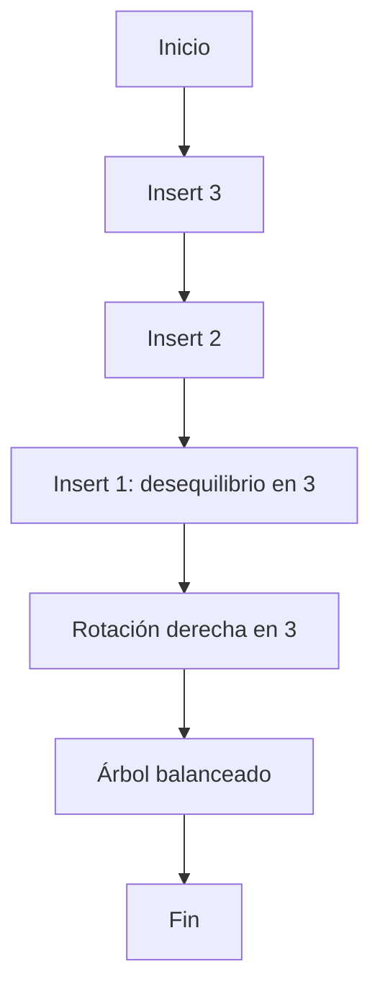

# Ejercicio 9.1: Insertar en AVL y aplicar rotación simple derecha  
**Descripción:**  
- **COMO:** Desarrollador  
- **QUIERO:** Insertar secuencialmente [3,2,1] en un AVL  
- **PARA:** Practicar rotación simple derecha  

**Entrada:**  
```
Insertar: 3, luego 2, luego 1
```

**Salida (In-Order):**  
```
1 2 3
```




```

```java
class AVLNode { int val, h; AVLNode left, right; AVLNode(int v){val=v; h=1;} }
public class AVLInsertSimpleRight {
    private AVLNode root;
    private int height(AVLNode n){ return n==null?0:n.h; }
    private AVLNode rotateRight(AVLNode y) {
        AVLNode x = y.left;
        y.left = x.right;
        x.right = y;
        y.h = Math.max(height(y.left), height(y.right)) + 1;
        x.h = Math.max(height(x.left), height(x.right)) + 1;
        return x;
    }
    private AVLNode insert(AVLNode n, int v) {
        if (n==null) return new AVLNode(v);
        if (v < n.val) n.left = insert(n.left,v);
        else n.right = insert(n.right,v);
        n.h = 1 + Math.max(height(n.left), height(n.right));
        if (height(n.left) - height(n.right) == 2) return rotateRight(n);
        return n;
    }
    public static void main(String[] args) {
        AVLInsertSimpleRight tree = new AVLInsertSimpleRight();
        tree.root = tree.insert(tree.root,3);
        tree.root = tree.insert(tree.root,2);
        tree.root = tree.insert(tree.root,1);
        new InOrder().print(tree.root);
    }
    static class InOrder { void print(AVLNode n){ if(n!=null){ print(n.left); System.out.print(n.val+" "); print(n.right);} }}
}
```