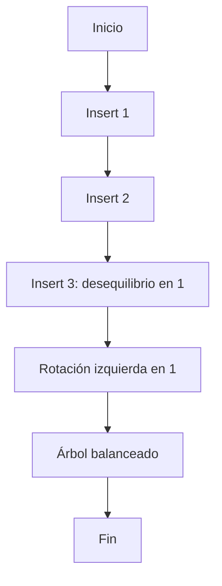

# Ejercicio 9.2: Insertar en AVL y aplicar rotación simple izquierda  
**Descripción:**  
- **COMO:** Ingeniero  
- **QUIERO:** Insertar secuencialmente [1,2,3] en un AVL  
- **PARA:** Practicar rotación simple izquierda  

**Entrada:**  
```
Insertar: 1, luego 2, luego 3
```

**Salida (In-Order):**  
```
1 2 3
```




```

```java
public class AVLInsertSimpleLeft extends AVLInsertSimpleRight {
    private AVLNode rotateLeft(AVLNode x) {
        AVLNode y = x.right;
        x.right = y.left;
        y.left = x;
        x.h = Math.max(height(x.left), height(x.right)) + 1;
        y.h = Math.max(height(y.left), height(y.right)) + 1;
        return y;
    }
    @Override
    protected AVLNode insert(AVLNode n, int v) {
        if (n==null) return new AVLNode(v);
        if (v < n.val) n.left = insert(n.left,v);
        else n.right = insert(n.right,v);
        n.h = 1 + Math.max(height(n.left), height(n.right));
        if (height(n.right) - height(n.left) == 2) return rotateLeft(n);
        return n;
    }
    public static void main(String[] args) {
        AVLInsertSimpleLeft tree = new AVLInsertSimpleLeft();
        tree.root = tree.insert(tree.root,1);
        tree.root = tree.insert(tree.root,2);
        tree.root = tree.insert(tree.root,3);
        new InOrder().print(tree.root);
    }
}
```